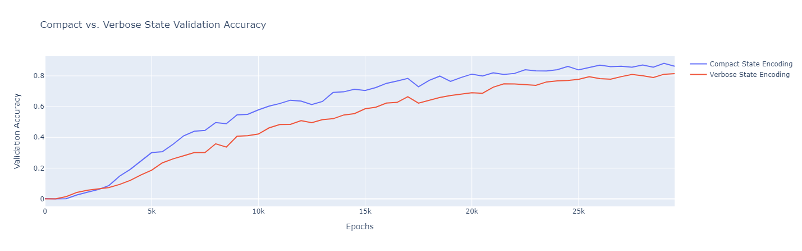

# Karel Reinforcement Learning Agent

This repo is an implementation for an RL MDP and Agent designed to solve maze-walking Karel tasks. It also offers a generic PyTorch implementation to two different Actor-Critic algorithms (namely, A2C & SAC) with an abstract neural agent interface that can be extended to many other algorithms as well. Throughout this document, multiple experiments will be presented along with their plots to test different agent and environment configurations. Using the code base should be relatively straightforward after seeing the examples below.

### Datasets & Pretrained Model
* Before running the repo code, you need to place the datasets in the prepared `datasets/` folder in their respective subfolders.
* The best performing model is provided in `pretrained/actor_critic_deploy.pth`, and it can be used in the way indicated in the last section.

## Project Structure:
The project is generally structure as follows:
* `algorithms`: contains our two gradient policy agents (i.e., A2C and SAC).
* `policy_models`: contains the PyTorch neural network definitions for agent policy.
* `pretrained`: contains the saved parameters for our best model.
* `environment.py`: contains our Karel Gym environment implementation
* `karel_agent.py`: contains the agent wrapper.
* `parse_utils.py`: contains utility functions for loading and vectorizing data.
* `solve_karel.py`: main runner

## How to Run:
Below are the two general steps to run the Karel solver:
1. Install all required packages specified in the `requirements.txt` conda environment file. Note that not all of them are strictly necessary, but it's safer to just install them for maximal reproducibility. The most important ones, however, are:
    * PyTorch 
    * Gym (for environment)
    * Numpy
2. The solver script to run is `solve_karel.py`; it should be executed through the command `python solve_karel.py <ARGS>`. The script requires exactly one of two named arguments. They specify the execution mode for the script and they are:
    * `--task-path` or just `-t`: Followed by a path to a single Karel task to be solved and printed to the screen. For convenience, you can place the JSON tasks inside the `input_tasks` folder to have a shorter path.
    * `--dataset-path` or just `-d`: Followed by a directory to several Karel tasks to be solved and written into `./testseqs`.
3. (optional) In addition to these two arguments, you can further provide the following Boolean arguments to disable the pre-action analytical features:
    * `--disable-env-probe`: Disables the crash-checks done by the agent via environment probing (enabled by default).
    * `--disable-cycle-detection`: Disables the cycle detection feature which will make the agent more prone to infinite decision loops before timeout (enabled by default).

**Note**: if you disable both analytical features, the command sequences would be based only on the neural policy (core actor). 

# Experiments:

### Import essential modules


```python
# Imports
import os
import torch
from algorithms import ActorCritic, SoftActorCritic
from environment import KarelEnv
from karel_agent import KarelAgent
from parse_utils import parse_dataset
from policy_models import ActorCriticMLP
import plotly.offline as pyo
import plotly.graph_objs as go
Set notebook mode to work in offline
pyo.init_notebook_mode()
from plot_utils import plot_lines


os.environ["CUDA_VISIBLE_DEVICES"] = "0"
torch_gen = torch.manual_seed(1998)
```

## RL Training Algorithm
As mentioned, here we try out both A2C and SAC and compare their results after training for 500K episodes without expert trajectories. To obtain performance comparison, run the following two cells, but beware that they take a long time to finish. The following plot only shows the first 50K episodes where the SAC is completely dormant which, admittedly, makes the plot not so useful, but it's there for mere reference. However, it starts to pick up around the 500K mark, but that wasn't included as it takes too long a time.


```python
env_binary = KarelEnv(is_compact=True, reward_func='binary')
env_complex = KarelEnv(is_compact=True, reward_func='complex')
X, y = parse_dataset(levels=["easy", "medium"], mode='train', compact=True)
X_test, y_test = parse_dataset(levels=["easy"], mode='val', compact=True)
state_size = 16*5 + 8

train_config = dict(max_episodes=500000, early_stop=None, learn_by_demo=False, verbose=True, load_pretrained=False)

a2c_policy = ActorCriticMLP(state_size, 6, soft_critic=False, hidden_sizes=(256, 256))
a2c_agent = ActorCritic(a2c_policy, env=env_binary, **train_config, variant_name='a2c_no_expert')

sac_policy = ActorCriticMLP(state_size, 6, soft_critic=True, hidden_sizes=(256, 256))
sac_agent = SoftActorCritic(sac_policy, env=env_binary, **train_config, variant_name='sac_no_expert')

stats_a2c = a2c_agent.train(X, data_val=(X_test, y_test))
stats_sac = sac_agent.train(X, data_val=(X_test, y_test))
```


```python
eval_steps_exp1 = list(range(0, 500*len(stats_a2c['accr']), 500))
val_accr_exp1 = {
    'A2C': [eval_steps_exp1, stats_a2c['accr']],
    'SAC': [eval_steps_exp1, stats_sac['accr']]
}

plot_lines(val_accr_exp1, axes_titles=('Episodes', 'Validation Accuracy'), title='A2C vs. SAC (validation accr)')

```

")

## State Encoding:
In our design, we try two state representations: a verbose one and a compact one. The following plot shows the performance comparison between the two:


```python
X_comp, y_comp = parse_dataset(levels=["medium", "hard"], mode='train', compact=True)
X_verb, y_verb = parse_dataset(levels=["medium", "hard"], mode='train', compact=False)

X_test_comp, y_test_comp = parse_dataset(levels=["hard"], mode='val', compact=True)
X_test_verb, y_test_verb = parse_dataset(levels=["hard"], mode='val', compact=False)

env_comp = KarelEnv(is_compact=True)
env_verb = KarelEnv(is_compact=False)

num_inputs_comp = 16*5 + 8
num_inputs_verb = 11*16

policy_comp = ActorCriticMLP(num_inputs_comp, 6, soft_critic=False, hidden_sizes=(128, 128))
policy_verb = ActorCriticMLP(num_inputs_verb, 6, soft_critic=False, hidden_sizes=(128, 128))

a2c_agent_comp = ActorCritic(policy_comp, env=env_comp, max_episodes=30000, early_stop=None, learn_by_demo=True, verbose=True, variant_name='compact_state')
a2c_agent_verb = ActorCritic(policy_verb, env=env_verb, max_episodes=30000, early_stop=None, learn_by_demo=True, verbose=True, variant_name='verbose_state')

stats_comp = a2c_agent_comp.train(X_comp, y_comp, data_val=(X_test_comp, y_test_comp))
stats_verb = a2c_agent_verb.train(X_verb, y_verb, data_val=(X_test_verb, y_test_verb))


```


```python
eval_steps_exp2 = list(range(0, 500*len(stats_comp['accr']), 500))
state_enc_accr = {
    'Compact State Encoding': [eval_steps_exp2, stats_comp['accr']],
    'Verbose State Encoding': [eval_steps_exp2, stats_verb['accr']]
}

plot_lines(state_enc_accr, axes_titles=('Epochs', 'Validation Accuracy'), title='Compact vs. Verbose State Validation Accuracy')
```


As shown, the compact state leads to considerably better performance.

## Network Architecture:
In this experiment, we optimize for the agent networks in terms of the number and size of hidden dense layers. Towards that end, we try 3 different network configurations and test them on the hard dataset after training on the combined dataset for 40K episodes.


```python
env = KarelEnv(is_compact=True)
X, y = parse_dataset(levels=["easy", "medium", "hard"], mode='train', compact=True)
X_test, y_test = parse_dataset(levels=["hard"], mode='val', compact=True)
state_size = 16*5 + 8

train_config = dict(max_episodes=40000, early_stop=None, verbose=True)

network_configs = [(256,), (128, 128), (256,256), (256,256,256)]
all_stats = []

for hidden_layers in network_configs:
    policy = ActorCriticMLP(state_size, 6, soft_critic=False, hidden_sizes=hidden_layers)
    ac_agent = ActorCritic(policy, env=env, learn_by_demo=True, **train_config, variant_name=f'arch_{hidden_layers}')
    train_stats = ac_agent.train(X, expert_traj=y, data_val=(X_test, y_test))
    all_stats.append(train_stats)

```


```python
eval_steps_exp3 = list(range(0, 500*len(all_stats[0]['accr']), 500))

val_accr_exp3 = {}
for i, stats in enumerate(all_stats):
    val_accr_exp3[str(network_configs[i])] = [eval_steps_exp3, stats['accr']]


plot_lines(val_accr_exp3, axes_titles=('Episodes', 'Validation Accuracy'), title='Agent Network Architecture (validation accr)')
```
")

## Imitation Learning:
In this technique, we use expert trajectories for episode rollouts instead of using the agent's policy, which leads to vast improvements in agent training since this essentially creates a supervised learning setting instead of letting the agent figure out the correct policy by exploration. The following experiment shows the massive improvement by using expert demonstrations. 


```python
env = KarelEnv(is_compact=True)
X, y = parse_dataset(levels=["easy", "medium"], mode='train', compact=True)
X_test, y_test = parse_dataset(levels=["easy"], mode='val', compact=True)
state_size = 16*5 + 8

train_config = dict(max_episodes=60000, early_stop=None, verbose=True)

policy1 = ActorCriticMLP(state_size, 6, soft_critic=False, hidden_sizes=(128, 128))
ac_agent_no_expert = ActorCritic(policy1, env=env, learn_by_demo=False, **train_config, variant_name='no_expert_easy')

policy2 = ActorCriticMLP(state_size, 6, soft_critic=False, hidden_sizes=(128, 128))
ac_agent_by_demo = ActorCritic(policy2, env=env, learn_by_demo=True, **train_config, variant_name='learn_by_demo_easy')

stats_no_demo = ac_agent_no_expert.train(X, data_val=(X_test, y_test))
stats_by_demo = ac_agent_by_demo.train(X, expert_traj=y, data_val=(X_test, y_test))
```


```python
eval_steps_exp4 = list(range(0, 500*len(stats_no_demo['accr']), 500))
val_accr_exp4 = {
    'No-expert Training': [eval_steps_exp4, stats_no_demo['accr']],
    'Expert-guided Training': [eval_steps_exp4, stats_by_demo['accr']]
}

plot_lines(val_accr_exp4, axes_titles=('Episodes', 'Validation Accuracy'), title='Effect of Imitation Learning (validation accr)')
```
")

## Reward Design
Towards increasing the informativeness of agent-environment interactions, we experiment with two reward functions:
1. Binary outcome-based reward:
    * $R(s,a)=1$ if pre-grid and post-grid match and $a=finish$
    * $R(s,a)=0$ otherwise
2. Complex proximity-based reward:
    * $R(s,a)=20$ if pre-grid and post-grid match and $a=finish$
    * $R(s,a)=-10$ if $a$ crashes the agent
    * $R(s,a)=1$ if $a=move$ and gets the agent closer to the destination (L1 distance)
    * $R(s,a)=-1$ if $a=move$ and gets the agent further from the destination while no markers need to be put/picked and all directions that get the agent closer are not blocked by walls.
    * $R(s,a)=3$ if $a=pickMarker$ on a marker that needs to be picked or $a=putMarker$ on a cell where a marker needs to be put.
    * $R(s,a)=-3$ if $a=pickMarker$ on a post-grid marker or $a=putMarker$ on a cell with no post-grid marker.
    * $R(s,a)=0$ otherwise.


```python
env_binary = KarelEnv(is_compact=True, reward_func='binary')
env_complex = KarelEnv(is_compact=True, reward_func='complex')

X, y = parse_dataset(levels=["easy", "medium"], mode='train', compact=True)
X_test, y_test = parse_dataset(levels=["easy"], mode='val', compact=True)
state_size = 16*5 + 8

train_config = dict(max_episodes=50000, early_stop=None, learn_by_demo=False, verbose=True, load_pretrained=False)

policy1 = ActorCriticMLP(state_size, 6, soft_critic=False, hidden_sizes=(128, 128))
a2c_agent_binary = ActorCritic(policy1, env=env_binary, **train_config, variant_name='binary_reward')

policy2 = ActorCriticMLP(state_size, 6, soft_critic=False, hidden_sizes=(128, 128))
a2c_agent_complex = ActorCritic(policy2, env=env_complex, **train_config, variant_name='complex_reward')

#stats_binary = a2c_agent_binary.train(X, data_val=(X_test, y_test))
stats_complex = a2c_agent_complex.train(X, data_val=(X_test, y_test))
```


```python
eval_steps_exp5 = list(range(0, 500*len(stats_binary['accr']), 500))
val_accr_exp5 = {
    'Binary Reward': [eval_steps_exp5, stats_binary['accr']],
    'Complex Reward': [eval_steps_exp5, stats_complex['accr']]
}

plot_lines(val_accr_exp5, axes_titles=('Episodes', 'Validation Accuracy'), title='Effect of Reward Complexity (validation accr)')
```
")

## Best Agent Configuration:
Our experiments conclude that the best-performing agent was an A2C trained to behaviorally clone the expert trajectories for 100K episodes on the combined training dataset of the three difficulty levels. The A2C is wrapped with an extra logic layer on top to probe that environment and make sure the agent does not crash while also preventing cycles through cycle detection and immediate reward optimization in case of cycles.


```python
X_test, y_test = parse_dataset(levels=["hard"], mode='val', compact=True)
state_size = 16*5 + 8
env_complex = KarelEnv(is_compact=True, reward_func='complex')

train_config = dict(max_episodes=100000, early_stop=None, load_pretrained=True)

a2c_policy = ActorCriticMLP(state_size, 6, soft_critic=False, hidden_sizes=(256, 256))
a2c_agent = ActorCritic(a2c_policy, env=env_complex, learn_by_demo=True, **train_config, variant_name='main_a2c')

print("Base A2C Performance:")
a2c_agent.evaluate(X_test, y_test, verbose=True)

print("Wrapped A2C Performance:")
karel_agent = KarelAgent(a2c_agent, env_complex)
karel_agent.solve(X_test, y_test)
```

    Base A2C Performance:
    Attempted 2400 tasks, correctly solved 2301. Accuracy(solved)=95.88%, Accuracy(optimally solved)=95.62%, avg extra steps=0.01
    Wrapped A2C Performance:
    Attempted 2400 tasks, correctly solved 2394. Accuracy(solved)=99.75%, Accuracy(optimally solved)=96.33%, avg extra steps=0.34
    
